# Device Integration Guide

> [!TIP]
> 🍼 **New to this?** If you just want a dead-simple, 3-step guide on how to punch someone in using the simulators, read the [Easy Tutorial](file:///c:/Users/fady/Documents/django%20projects/payroll/simulators/EASY_TUTORIAL.md) first! This page is for advanced technical details.

How to integrate physical or simulated punching machines (Hikvision, ZKTeco, Suprema, etc.) with this payroll system.

---

## Table of Contents

1. [Architecture Overview](#1-architecture-overview)
2. [Device Registration](#2-device-registration)
3. [Authentication Flow](#3-authentication-flow)
4. [Push API — Receiving Punches](#4-push-api--receiving-punches)
5. [Punch Processing Flow](#5-punch-processing-flow)
6. [Quick Start with Simulators](#6-quick-start-with-simulators)
7. [Connecting a Real Physical Device](#7-connecting-a-real-physical-device)
8. [Supported Device Types](#8-supported-device-types)
9. [Punch Payload Reference](#9-punch-payload-reference)
10. [Troubleshooting](#10-troubleshooting)

---

## 1. Architecture Overview

### High-Level System Diagram

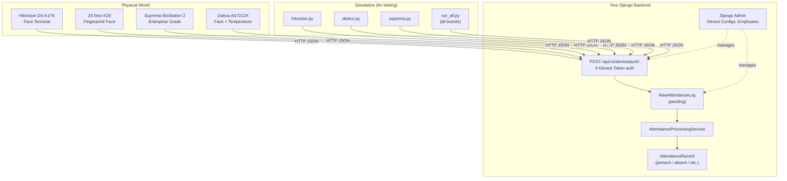

### End-to-End Punch Flow

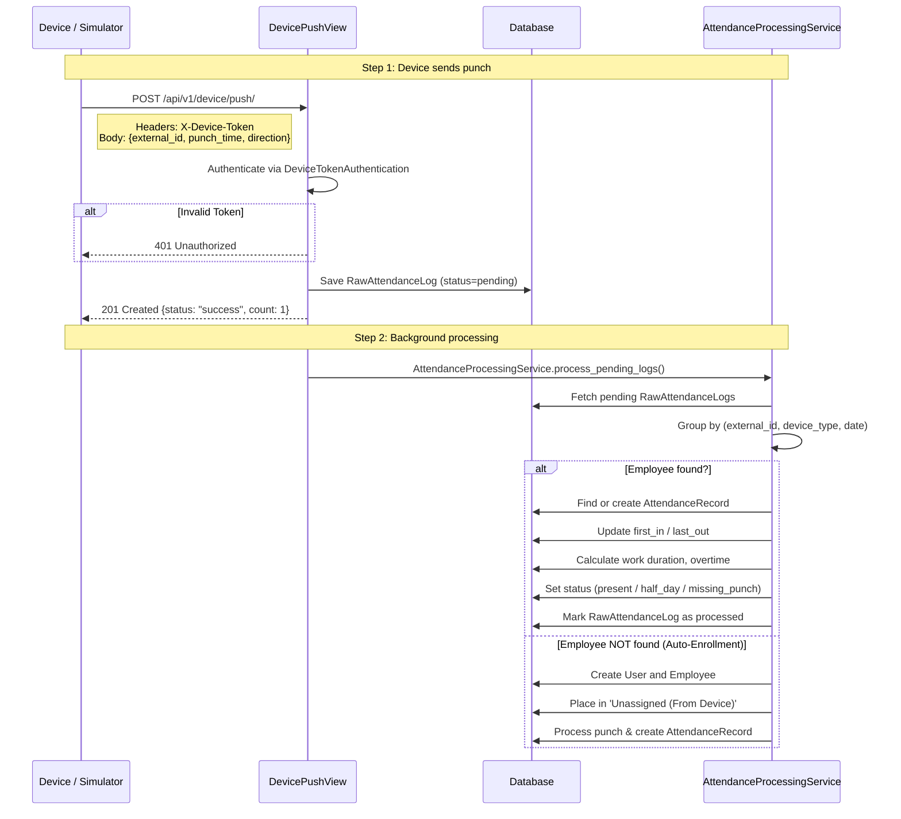

---

## 2. Device Registration

Before any device can push data, it must be registered as a `DeviceConfiguration` in the database.

### Decision Tree — How to Register

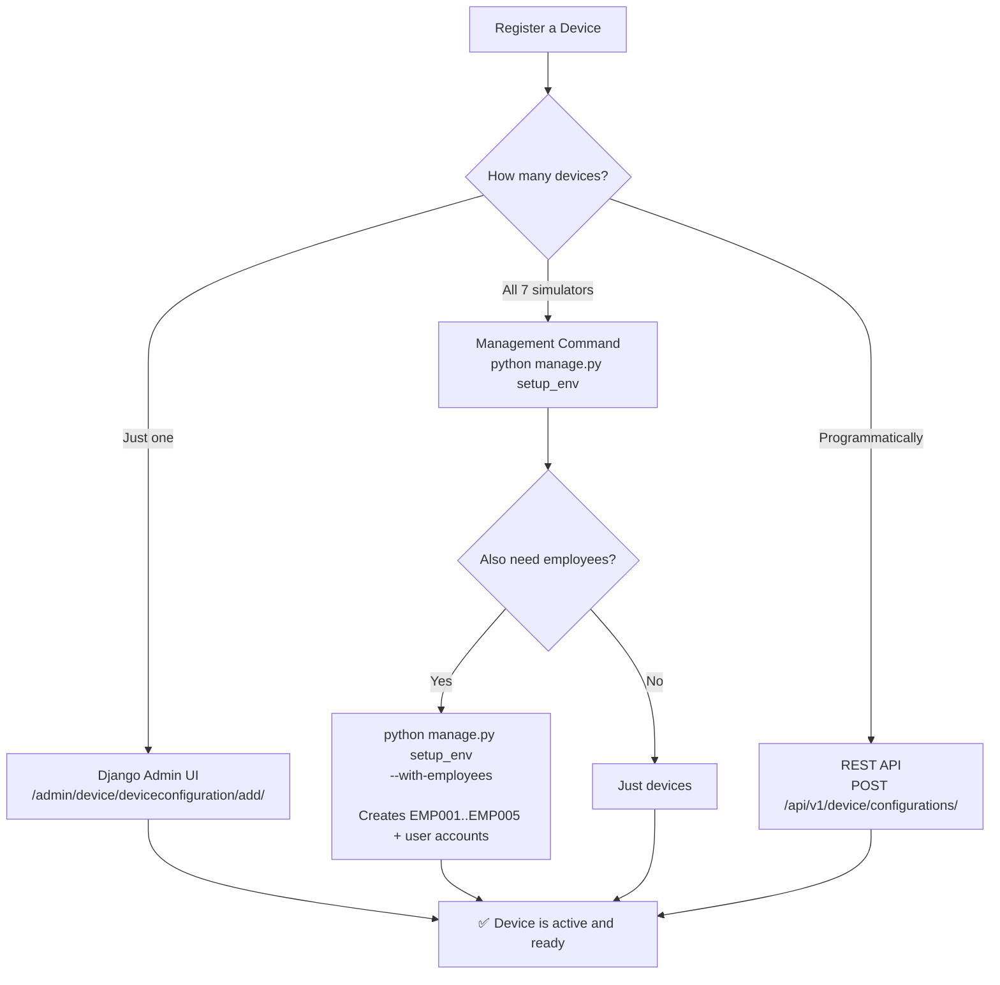

### 2.1 Via Django Admin UI

1. Go to `/admin/device/deviceconfiguration/`
2. Click **"Add Device Configuration"**
3. Fill in the fields:

| Field | Description | Example |
|-------|-------------|---------|
| `company` | The company this device belongs to | `Acme Corp` |
| `name` | Friendly name | `Main Entrance Face Terminal` |
| `device_type` | Brand/model identifier | `hikvision_ds-k1t6` |
| `api_token` | **Auto-generated UUID** — this is the device's secret key | `00000000-...` |
| `ip_address` | Device IP (optional, for reference) | `192.168.1.100` |
| `port` | Device port (optional) | `80` |
| `serial_number` | Device serial (optional) | `DS-K1T62024010001` |
| `auth_credentials` | Device login (optional JSON) | `{"username": "admin"}` |
| `is_active` | Must be checked to accept punches | ✅ |

### 2.2 Via Management Command (for Simulators)

The fastest way to register **all 7 simulator devices at once**:

```bash
cd Backend
python manage.py setup_env --with-employees
```

This creates:

| Brand | Device Name | Device Type | Token (UUID) |
|-------|-------------|-------------|--------------|
| Hikvision | Hikvision DS-K1T6 (Sim) | `hikvision_ds-k1t6` | `00000000-0000-0000-0000-000000000101` |
| ZKTeco | ZKTeco K30 (Sim) | `zkteco_k30` | `00000000-0000-0000-0000-000000000102` |
| Anviz | Anviz VF30 (Sim) | `anviz_vf30` | `00000000-0000-0000-0000-000000000103` |
| Suprema | Suprema BioStation 2 (Sim) | `suprema_biostation2` | `00000000-0000-0000-0000-000000000104` |
| Dahua | Dahua AS7212X (Sim) | `dahua_as7212x` | `00000000-0000-0000-0000-000000000105` |
| IDEMIA | IDEMIA MorphoWave (Sim) | `idemia_morphowave` | `00000000-0000-0000-0000-000000000106` |
| Sifarma | Sifarma Biometric (Sim) | `sifarma_biometric` | `00000000-0000-0000-0000-000000000107` |

**Sample employees created with `--with-employees`:**

| Employee ID | Username | Password |
|-------------|----------|----------|
| `EMP001` | `employee_emp001` | `test1234` |
| `EMP002` | `employee_emp002` | `test1234` |
| `EMP003` | `employee_emp003` | `test1234` |
| `EMP004` | `employee_emp004` | `test1234` |
| `EMP005` | `employee_emp005` | `test1234` |

**Other flags:**

```bash
# Skip the interactive prompts
python manage.py setup_env --no-input

# Automatically create 5 employees
python manage.py setup_env --with-employees
```

> **Important:** If no company exists, the command will fail. Create a company first in the Django admin (`/admin/payroll/company/add/`).

### 2.3 Via REST API (Programmatic)

Requires a JWT token for an admin user:

```bash
# Get JWT token
curl -X POST http://127.0.0.1:8000/api/v1/token/ \
  -H "Content-Type: application/json" \
  -d '{"username": "admin", "password": "yourpassword"}'

# Create device config
curl -X POST http://127.0.0.1:8000/api/v1/device/configurations/ \
  -H "Authorization: Bearer <jwt_token>" \
  -H "Content-Type: application/json" \
  -d '{
    "company": 1,
    "name": "Main Entrance Face Terminal",
    "device_type": "hikvision_ds-k1t6",
    "ip_address": "192.168.1.100",
    "is_active": true
  }'
```

---

## 3. Authentication Flow

### Token Verification Sequence

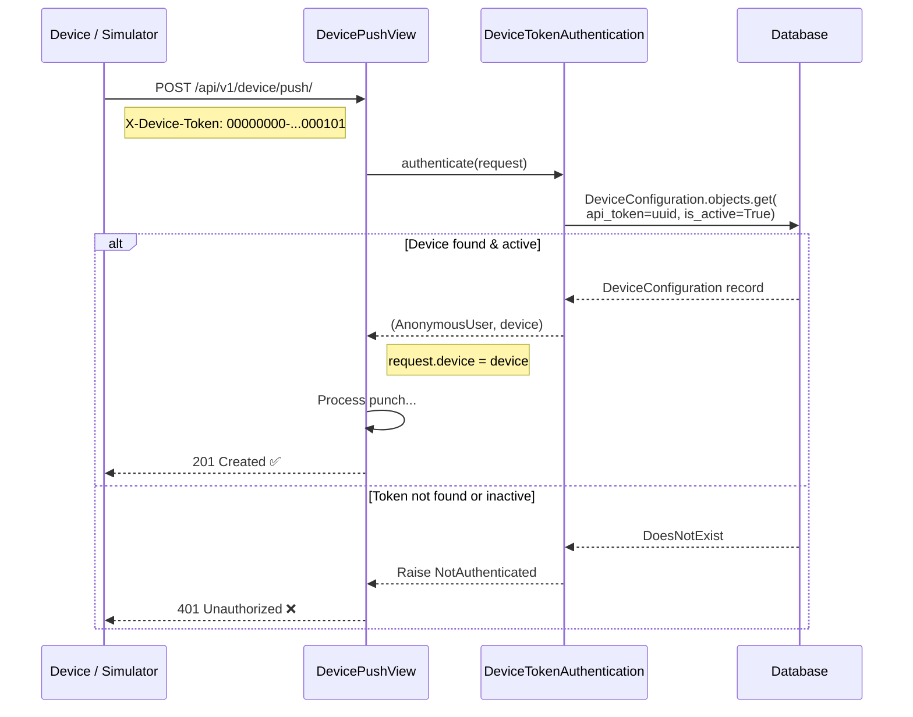

**Key points:**
- The `X-Device-Token` header is a UUID stored in `DeviceConfiguration.api_token`
- The device must have `is_active=True`
- The token functions as a **secret key** — treat it like a password
- For production, always use **HTTPS** and rotate tokens periodically

---

## 4. Push API — Receiving Punches

### 4.1 Single Punch

```http
POST /api/v1/device/push/
Content-Type: application/json
X-Device-Token: 00000000-0000-0000-0000-000000000101

{
  "external_id": "EMP001",
  "punch_time": "2025-06-26T08:15:00",
  "direction": "in"
}
```

**Response (201 Created):**

```json
{
  "status": "success",
  "count": 1
}
```

### 4.2 Batch Punches

Send multiple punches in one request:

```http
POST /api/v1/device/push/
Content-Type: application/json
X-Device-Token: 00000000-0000-0000-0000-000000000101

[
  {
    "external_id": "EMP001",
    "punch_time": "2025-06-26T08:15:00",
    "direction": "in"
  },
  {
    "external_id": "EMP002",
    "punch_time": "2025-06-26T08:20:00",
    "direction": "in"
  },
  {
    "external_id": "EMP001",
    "punch_time": "2025-06-26T17:05:00",
    "direction": "out"
  }
]
```

**Response (201 Created):**

```json
{
  "status": "success",
  "count": 3
}
```

### 4.3 Payload Fields

| Field | Type | Required | Description |
|-------|------|----------|-------------|
| `external_id` | string | ✅ | Employee ID as known by the device (maps to `Employee.employee_id` or `device_user_ids`) |
| `punch_time` | ISO-8601 datetime | ✅ | When the punch occurred (e.g. `2025-06-26T08:15:00`) |
| `direction` | `"in"` or `"out"` | ❌ | Punch direction. If omitted, stored as `null` |

### 4.4 Error Responses

| Status | Meaning |
|--------|---------|
| `400` | Invalid payload (missing fields, bad datetime format) |
| `401` | Missing or invalid `X-Device-Token` |
| `401` | Device exists but `is_active` is `False` |

---

## 5. Punch Processing Flow

### What Happens After a Push

This is the most important diagram — it shows why your punch might or might not create an `AttendanceRecord`.

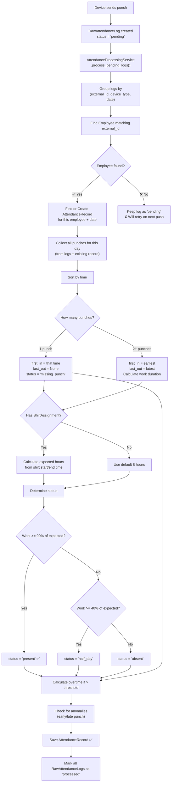

### Real-World Example Scenarios

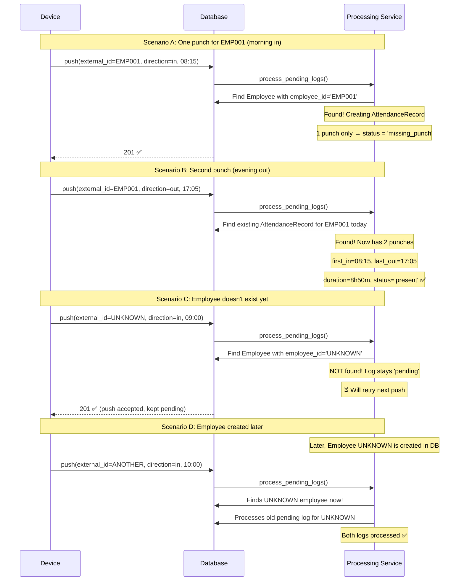

---

## 6. Quick Start with Simulators

The `simulators/` folder contains ready-made Python scripts that mimic real punching devices.

### 6.1 Prerequisites

```bash
# 1. Install dependencies
cd Backend
pip install -r requirements.txt

# 2. Apply migrations
python manage.py migrate

# 3. Register devices + employees (one-time)
python manage.py register_simulators --with-employees

# 4. Start server
python manage.py runserver
```

> **⚠️ Critical:** The `--with-employees` flag creates `EMP001` through `EMP005` with matching user accounts. Without existing employees, punches are stored as `RawAttendanceLog` but marked `failed` — **no `AttendanceRecord` is created**.

### 6.2 Using the Convenience Script

```bash
# From the project root (payroll/)
cd ..

# Send ONE "in" punch → creates AttendanceRecord ✅
python simulators/simulate.py hikvision EMP001

# Send ONE "out" punch → updates the same record
python simulators/simulate.py hikvision EMP001 --direction out

# Generate 5 days of data for 3 employees
python simulators/simulate.py zkteco EMP001,EMP002,EMP003 --batch --days 5

# Interactive loop — alternates in/out every 3 seconds
python simulators/simulate.py suprema EMP001 --interactive --delay 3

# Run ALL 7 brands at once
python simulators/simulate.py all EMP001,EMP002 --days 10
```

### 6.3 Using Individual Brand Scripts

```bash
cd simulators
python hikvision.py EMP001 --batch --days 5
python zkteco.py EMP001 --interactive --delay 3
```

### 6.4 List Available Simulators

```bash
python simulators/simulate.py list
```

Output:

```
Available simulators:
  hikvision        Hikvision (hikvision_ds-k1t6)
  zkteco           ZKTeco (zkteco_k30)
  anviz            Anviz (anviz_vf30)
  suprema          Suprema (suprema_biostation2)
  dahua            Dahua (dahua_as7212x)
  idemia           IDEMIA (idemia_morphowave)
  sifarma          Sifarma (sifarma_biometric)
```

### 6.5 Simulator Options (All Brands)

| Argument | Description | Default |
|----------|-------------|---------|
| `employees` | Employee ID(s), comma-separated | *(required)* |
| `--url` | Backend URL | `http://127.0.0.1:8000` |
| `--token` | Device API token (uses fixed token if omitted) | *auto* |
| `--direction` | Punch direction: `in` or `out` | `in` |
| `--device-name` | Friendly name for the device | *brand-specific* |
| `-i` / `--interactive` | Run loop (alternates in/out) | off |
| `--delay` | Seconds between interactive punches | `3.0` |
| `-b` / `--batch` | Generate historical batch data | off |
| `--days` | Number of past days to simulate | `5` |

### 6.6 Verifying Results

After running a simulator, check your results:

```bash
# From the command line
python manage.py shell -c "
from django.utils import timezone
from device.models import RawAttendanceLog
from payroll.models import AttendanceRecord

today = timezone.localdate()

print('=== Raw Logs ===')
for log in RawAttendanceLog.objects.filter(punch_time__date=today):
    print(f'  {log.external_id:10s} {log.direction:4s} {log.status:10s} device={log.device.name}')

print()
print('=== Attendance Records ===')
for rec in AttendanceRecord.objects.filter(date=today):
    print(f'  {rec.employee.employee_id:10s} status={rec.status:15s} in={rec.first_in} out={rec.last_out}')
    print(f'  Work: {rec.total_work_seconds//3600}h{rec.total_work_seconds%3600//60}m  OT: {rec.overtime_seconds//60}m')
"
```

You can also check in the Django admin:

| Page | URL | What to look for |
|------|-----|------------------|
| Raw Logs | `/admin/device/rawattendancelog/` | Status = `processed` ✅ or `failed` ❌ |
| Attendance Records | `/admin/payroll/attendancerecord/` | Record exists for today's date |
| Employees | `/admin/payroll/employee/` | Confirm EMP001 exists |

### 6.7 Simulator Attendance Patterns

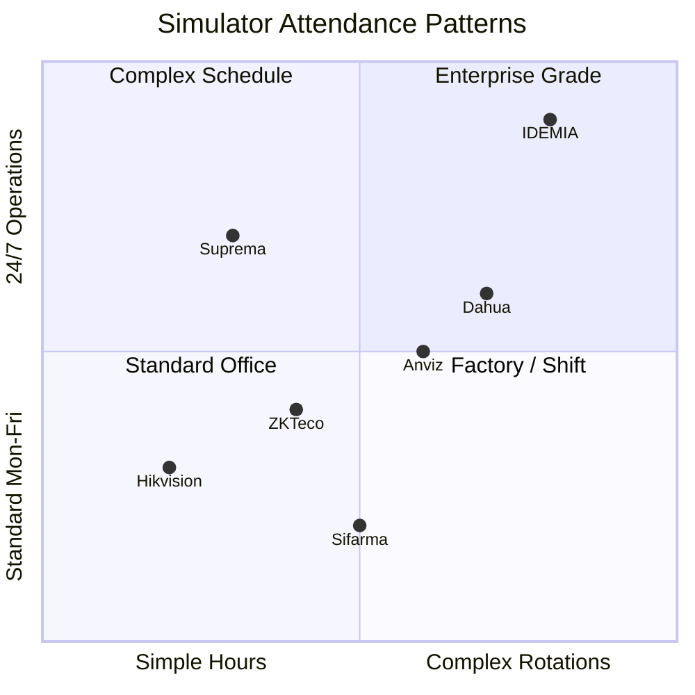

| Simulator | Shift Pattern | Special Behavior |
|-----------|--------------|------------------|
| **Hikvision** | Mon-Fri office (7-9 AM in / 4-6 PM out) | Standard hours |
| **ZKTeco** | Mon-Fri with overtime | ~15% get overtime (post-7 PM), random late arrivals |
| **Anviz** | 3 rotating shifts | Morning (6-14), Day (8-17), Night (20-5) |
| **Suprema** | Office + lunch breaks | ~40% record lunch breaks (out + in) |
| **Dahua** | Factory split shifts | ~10% work split shifts, wider morning windows |
| **IDEMIA** | 24/7 enterprise | 5 shift rotations, overnight, weekend work (~30%) |
| **Sifarma** | Brazilian Mon-Sat | Half-day Saturday (8-12), 1-hour lunch break |

---

## 7. Connecting a Real Physical Device

### 7.1 Hikvision Face Terminal (DS-K1T6 series)

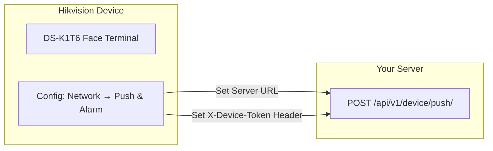

1. **Log into the device web interface**
2. Go to **Configuration → Network → Advanced → Push and Alarm**
3. Set the server URL to: `http://your-server:8000/api/v1/device/push/`
4. Add `X-Device-Token` to the HTTP headers with your device token
5. Configure event type: **Attendance/Punch events only**

### 7.2 ZKTeco Device (K30 / MB360 / SpeedFace)

**Option A — ZKBioSecurity middleware:**
- Configure the middleware to forward transactions to your HTTP endpoint
- Push URL: `http://your-server:8000/api/v1/device/push/`
- Add `X-Device-Token` header

**Option B — Direct SDK:**
- Use ZKTeco Push SDK for real-time forwarding
- The SDK sends POST requests with the standard payload format

### 7.3 Generic Device (Any Brand)

Configure your device or middleware to send HTTP POST requests to:

```
POST http://your-server:8000/api/v1/device/push/
X-Device-Token: <your_device_token>
Content-Type: application/json

{"external_id": "<employee_id>", "punch_time": "<iso_timestamp>", "direction": "in"}
```

---

## 8. Supported Device Types

| `device_type` | Brand | Protocol | Typical Models |
|--------------|-------|----------|----------------|
| `hikvision_ds-k1t6` | Hikvision | ISAPI/HTTP | DS-K1T6, DS-K1T672, DS-K1T343 |
| `zkteco_k30` | ZKTeco | ZK-ICP/TCP | K30, MB360, SpeedFace V5L, inBio460 |
| `anviz_vf30` | Anviz | AnvizTCP | VF30, T5, CrossChex, EP300 |
| `suprema_biostation2` | Suprema | HTTPS/REST | BioStation 2, FaceStation 2, XPass D2 |
| `dahua_as7212x` | Dahua | DahuaHTTP | DHI-AS7212X, DH-IPM, VTO series |
| `idemia_morphowave` | IDEMIA | HTTPS/REST | MorphoWave Compact, Sigma, VisionAccess |
| `sifarma_biometric` | Sifarma | SifarmaTCP | Sifarma FP2000, Sifarma Bio |

---

## 9. Punch Payload Reference

### Accepted Format

**Single object:**

```json
{
  "external_id": "EMP001",
  "punch_time": "2025-06-26T08:15:00",
  "direction": "in"
}
```

**Array of objects (batch):**

```json
[
  { "external_id": "EMP001", "punch_time": "2025-06-26T08:15:00", "direction": "in" },
  { "external_id": "EMP002", "punch_time": "2025-06-26T08:20:00", "direction": "in" },
  { "external_id": "EMP001", "punch_time": "2025-06-26T17:05:00", "direction": "out" }
]
```

### Storage

When a push is received, the raw payload is stored in the `raw_data` JSON field of `RawAttendanceLog`. This preserves the full original data from the device, including any extra fields (temperature, verification method, etc.).

### Data Model Relationships

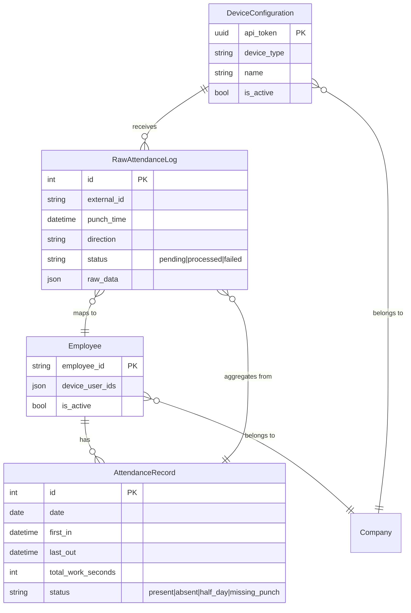

---

## 10. Troubleshooting

### 10.1 "401 Unauthorized" on Push

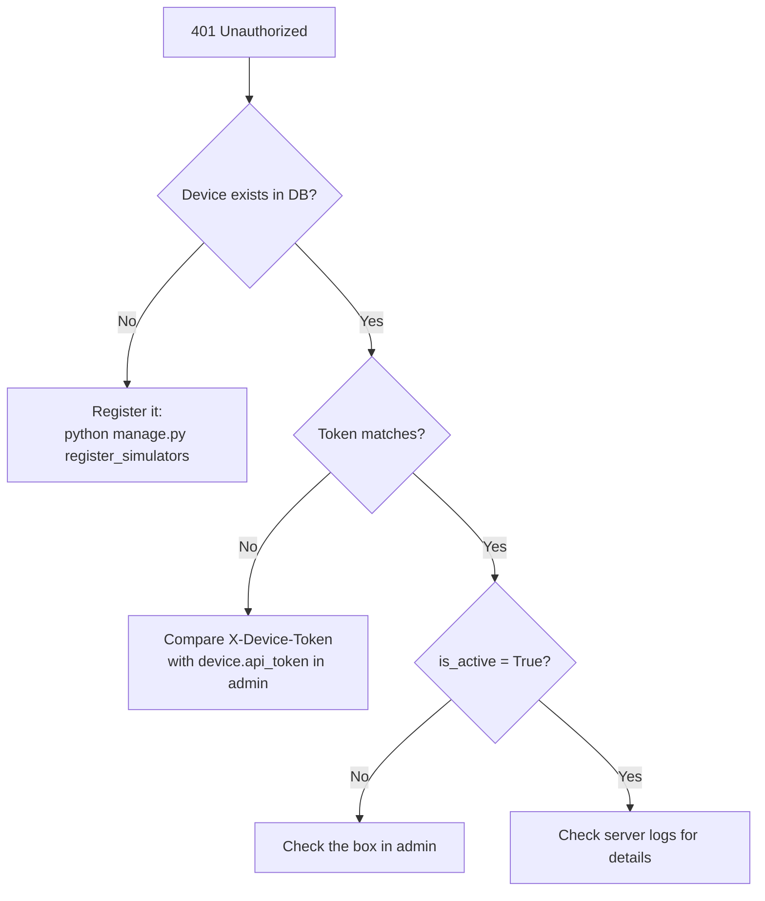

```bash
# Verify devices
python manage.py shell -c "
from device.models import DeviceConfiguration
for d in DeviceConfiguration.objects.all():
    print(d.name, d.api_token, 'active' if d.is_active else 'INACTIVE')
"
```

### 10.2 "400 Bad Request" on Push

**Causes:**
- Missing `external_id` or `punch_time` field
- Invalid datetime format (must be ISO-8601)
- Empty array `[]` sent

```bash
# Test with minimal valid payload
curl -X POST http://127.0.0.1:8000/api/v1/device/push/ \
  -H "X-Device-Token: <token>" \
  -H "Content-Type: application/json" \
  -d '{"external_id": "EMP001", "punch_time": "2025-06-26T08:00:00"}'
```

### 10.3 Raw Log Stays "pending" (Never Processes)

If a log stays `pending` after multiple pushes, it means the employee wasn't found.
The log is **not** marked `failed` — it will auto-retry every time a new push arrives.

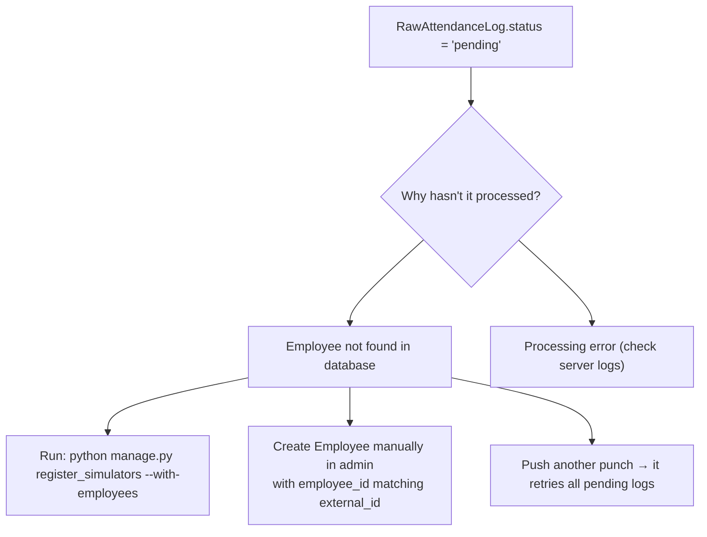

**Check which logs are stuck:**
```bash
python manage.py shell -c "
from device.models import RawAttendanceLog
logs = RawAttendanceLog.objects.filter(status='pending')
print(f'Found {logs.count()} pending logs:')
for l in logs:
    print(f'  {l.external_id:10s} at {l.punch_time} from {l.device.name}')
"
```

**Fix:**
```bash
# 1. Create employees (if you haven't)
python manage.py register_simulators --with-employees

# 2. Push another punch — it will retry all pending logs automatically
python simulators/simulate.py hikvision EMP001 --direction out
```

### 10.4 Punches Sent but Attendance Record Missing

This is the most common issue. The push API returns `201 Created` immediately, but the `AttendanceRecord` depends on a matching `Employee`.

**Verify the chain:**
```bash
python manage.py shell -c "
from django.utils import timezone
from device.models import RawAttendanceLog
from payroll.models import AttendanceRecord

today = timezone.localdate()

print('=== Raw Logs for today ===')
for log in RawAttendanceLog.objects.filter(punch_time__date=today):
    print(f'  {log.external_id:10s} status={log.status:10s} failed={log.status==\"failed\"}')

print()
print('=== Employees in DB ===')
from payroll.models import Employee
for emp in Employee.objects.filter(is_active=True):
    print(f'  {emp.employee_id:10s} {emp.user.username}')

print()
print('=== Attendance Records for today ===')
recs = AttendanceRecord.objects.filter(date=today)
if recs:
    for r in recs:
        print(f'  {r.employee.employee_id:10s} status={r.status}')
else:
    print('  ❌ No records — employee IDs probably do not match')
"
```

### 10.5 Using Environment Variable for Token

```bash
# Windows PowerShell
$env:SIMULATOR_DEVICE_TOKEN="00000000-0000-0000-0000-000000000101"
python simulators/simulate.py hikvision EMP001

# Linux/macOS
export SIMULATOR_DEVICE_TOKEN="00000000-0000-0000-0000-000000000101"
python simulators/simulate.py hikvision EMP001
```

---

## Quick Reference Card

```bash
# ┌─────────────────────────────────────────────────────────────┐
# │  ONE-TIME SETUP (from Backend/)                             │
# └─────────────────────────────────────────────────────────────┘
python manage.py migrate
python manage.py setup_env  # ← Creates company, devices, and asks to create EMP001..EMP005
python manage.py runserver

# ┌─────────────────────────────────────────────────────────────┐
# │  TEST PUNCHES (from project root, in another terminal)      │
# └─────────────────────────────────────────────────────────────┘
python simulators/simulate.py hikvision EMP001                 # IN  → AttendanceRecord created
python simulators/simulate.py hikvision EMP001 --direction out # OUT → updates record
python simulators/simulate.py zkteco EMP001 --interactive      # alternates in/out
python simulators/simulate.py all EMP001,EMP002 --days 10      # all brands, 10 days
python simulators/simulate.py list                             # show available brands

# ┌─────────────────────────────────────────────────────────────┐
# │  VERIFY (from Backend/)                                     │
# └─────────────────────────────────────────────────────────────┘
python manage.py shell -c "
from django.utils import timezone
from payroll.models import AttendanceRecord
today = timezone.localdate()
for r in AttendanceRecord.objects.filter(date=today):
    print(f'{r.employee.employee_id} | {r.status} | {r.first_in} → {r.last_out} | OT={r.overtime_seconds//60}m')
"
```

### Common Commands Cheatsheet

| Task | Command |
|------|---------|
| Register devices + employees | `python manage.py register_simulators --with-employees` |
| Register only devices | `python manage.py register_simulators` |
| List simulator tokens | `python manage.py register_simulators --list` |
| Push IN punch | `python simulators/simulate.py hikvision EMP001` |
| Push OUT punch | `python simulators/simulate.py hikvision EMP001 --direction out` |
| Batch 5 days of data | `python simulators/simulate.py zkteco EMP001,EMP002 --batch --days 5` |
| Interactive loop | `python simulators/simulate.py suprema EMP001 --interactive` |
| Run all brands | `python simulators/simulate.py all EMP001,EMP002 --days 10` |
| List brands | `python simulators/simulate.py list` |
| Check failed logs | `python manage.py shell -c "from device.models import RawAttendanceLog; [print(l.external_id, l.status) for l in RawAttendanceLog.objects.filter(status='failed')]" ` |
| View today's records | `python manage.py shell -c "from django.utils import timezone; from payroll.models import AttendanceRecord; [print(r.employee.employee_id, r.status, r.first_in, r.last_out) for r in AttendanceRecord.objects.filter(date=timezone.localdate())]" ` |
